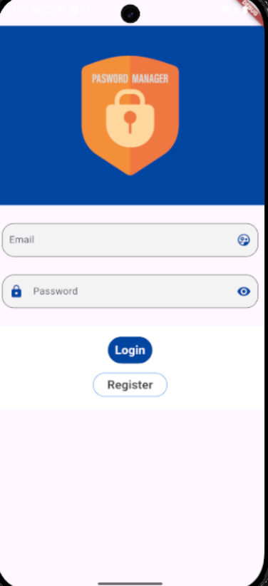
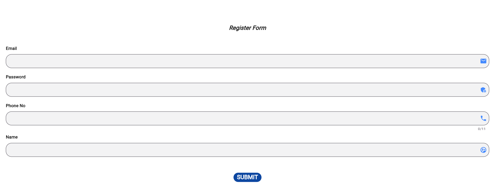
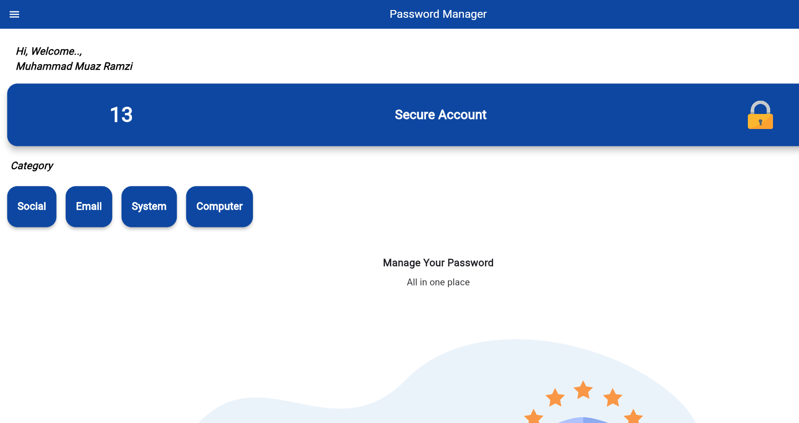
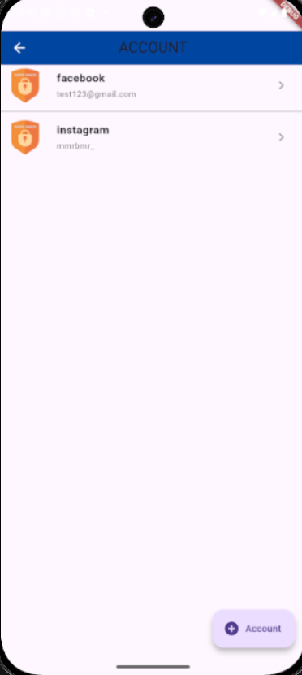
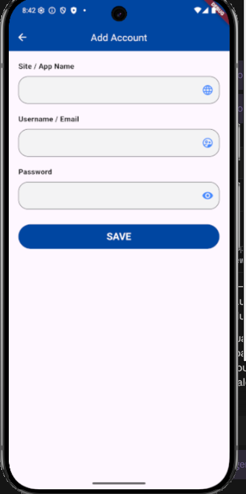
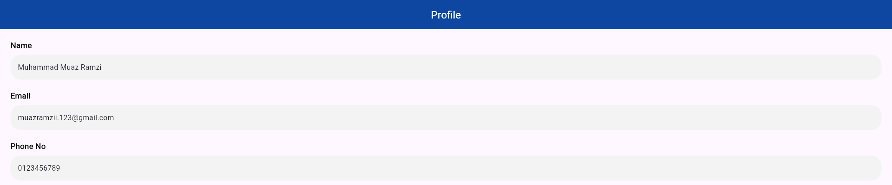
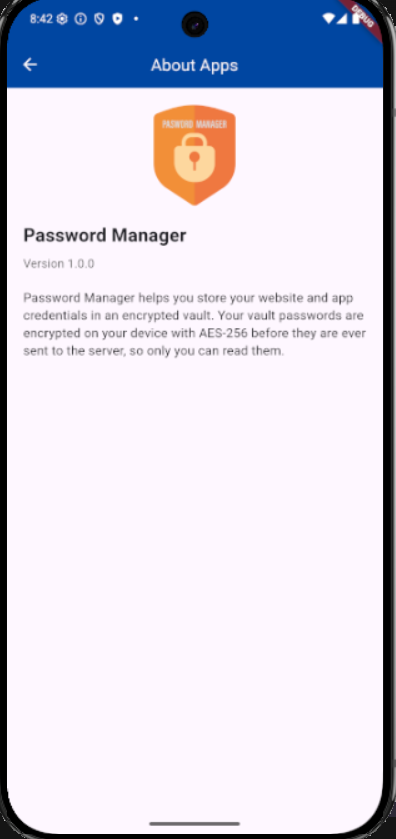

# Password Manager

A Flutter password manager originally built as a diploma Final Year Project
(Politeknik Ungku Omar, 2021) — "Password Manager Apps With Encryption".

Users register and log in, then store website/app credentials in an
encrypted vault. Passwords are encrypted **client-side** with AES-256
before they ever leave the device, so the backend only ever stores
ciphertext.

## The story

This started in Short Semester 2021 as a group FYP at Politeknik Ungku
Omar (Security Track) — "Password Manager Apps With Encryption" by
Muhammad Muaz Ramzi, Hasan Albasri, and Muhammad Faris, supervised by
Encik Mohd Nizam B. Kamarull Baharin. The technical report frames the
problem plainly: people reuse weak passwords across too many accounts
because remembering a strong, unique one for every site is impractical,
and that's exactly the habit that gets accounts hacked. The proposed fix
was a mobile vault — register once, store every other username/password
behind it, encrypted.

The original build ran on Android Studio + Flutter, talking to a PHP/MySQL
backend hosted via cPanel/phpMyAdmin. It shipped, passed its unit and
integration testing plan, and the report itself is honest about its
limitations: no confirmation step before a user could delete or edit
data, and no offline support. Its recommendations for future work
included going multi-platform (web, iOS) — none of which had been
built yet. On top of that, the encryption the title promises was more
asserted in the writeup than demonstrated in the code.

Revisiting it in 2026 for a portfolio rebuild surfaced a more basic
problem first: the PHP backend's domain doesn't resolve anymore — it's
simply gone. And a closer read of the original `ListAccount` screen
showed its "Add" button never actually added anything, and its data
fetch call pointed at an unrelated, mismatched API left over from a
different template. The vault feature had never really been wired up
end to end.

So this version keeps the original's idea and screens, but replaces
what's underneath: **Supabase** (Postgres + Auth, Row Level Security)
instead of the dead PHP endpoints, and **real client-side AES-256
encryption** (keyed by a PBKDF2 derivation of the login password) instead
of an unimplemented claim — closing the gap between what the FYP report
described and what the app actually did. See the [Architecture](#architecture)
section below for how that's built, and [Screenshots](#screenshots) for
what it looks like today.

## Screenshots

| Login | Register |
|---|---|
|  |  |

Sign in with Supabase Auth, or register a new account — the master
password set here is also what derives the AES key for the vault below.

| Home |
|---|
|  |

Landing screen after login, with quick access to the vault ("Secure
Account") and category shortcuts.

| List Account | Add Account |
|---|---|
|  |  |

The vault: saved entries are fetched from Supabase and decrypted
on-device; adding one encrypts the password client-side before it's ever
sent to the server.

| Profile | About Apps |
|---|---|
|  |  |

*(Screenshots are captured via `lib/main_screenshot.dart`, a standalone
harness that renders one screen at a time with mock data — see the file
for how to regenerate them after a UI change.)*

## Architecture

- **Flutter** app (Dart, null-safe, Flutter 3.29+)
- **Supabase** for Auth (email/password) and Postgres storage, with Row
  Level Security so each user can only read/write their own data
- **Client-side AES-256-CBC encryption**, keyed by a PBKDF2 (HMAC-SHA256)
  derivation of the user's login password + a random per-user salt. The
  derived key only ever lives in memory on-device; Supabase never sees a
  plaintext vault password.

### Data model

- `profiles` — name/phone + per-user `kdf_salt`, auto-created via a
  Postgres trigger (`handle_new_user`) when a new `auth.users` row is
  created (see `supabase/migrations`).
- `vault_items` — one row per saved account: `site_name`,
  `account_username`, `encrypted_password`, `iv`. Both tables have RLS
  policies restricting all access to `auth.uid()`.

## Getting started

1. Install [Flutter](https://flutter.dev/docs/get-started/install) (3.29+)
   and run:
   ```
   flutter pub get
   ```
2. The app is already pointed at a live Supabase project
   (`lib/Singletons/SupabaseConfig.dart`). To point it at your own project
   instead, create a Supabase project and apply the SQL files in
   `supabase/migrations/` in order, then update `SupabaseConfig.url` and
   `SupabaseConfig.publishableKey`.
3. Run the app:
   ```
   flutter run
   ```
   (or `flutter build web` / `flutter create --platforms=web .` if you
   want a browser target)

## Tests

```
flutter test
```

`test/crypto_roundtrip_check.dart` is a standalone script (not part of the
suite) for manually sanity-checking the encryption round-trip:

```
dart run test/crypto_roundtrip_check.dart
```

## Android release builds

The app is signed for release and ready to build a Play Store bundle:

```
flutter build appbundle --release   # .aab for Play Store upload
flutter build apk --release         # .apk for direct install/testing
```

This requires `android/key.properties` (gitignored, not in this repo) pointing
at a release keystore:

```
storePassword=...
keyPassword=...
keyAlias=...
storeFile=/absolute/path/to/keystore.jks
```

**The release keystore is not part of this repo and must never be committed.**
Losing it means you can never publish an update to the same Play Store
listing again — back it up somewhere durable (not just this machine).

## Known limitations

- Profile screen is read-only (no editing yet).
- No password-reset flow yet — relies on Supabase Auth defaults.
- Release build has been verified to build, sign (real keystore, not debug),
  and minify correctly, but has not been installed and exercised on a
  physical/emulated Android device — do that before submitting to Play Store.
